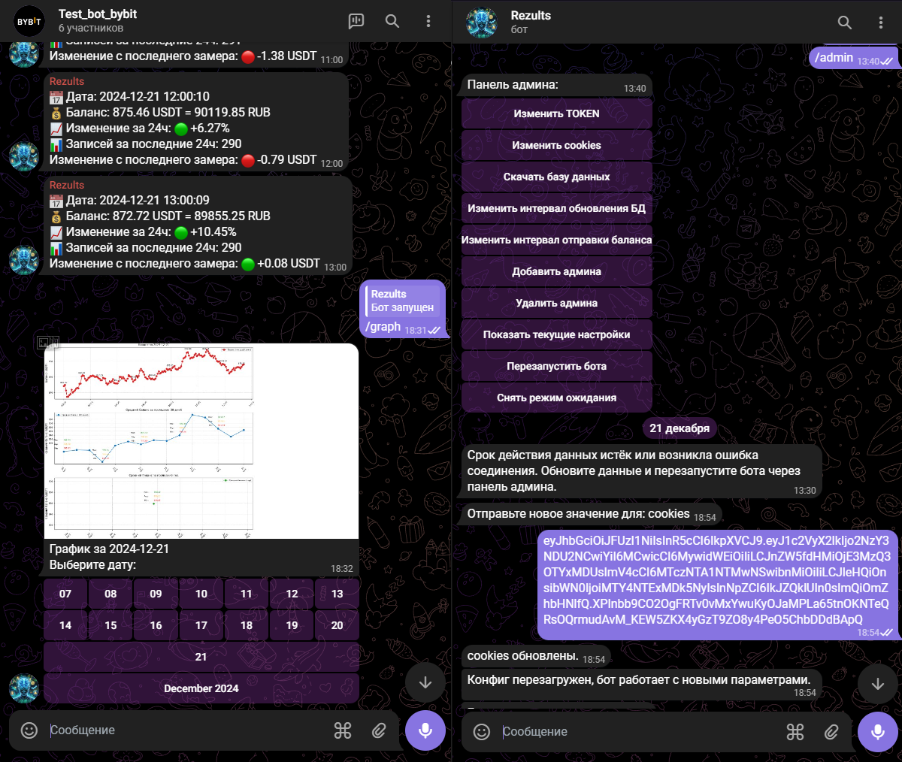
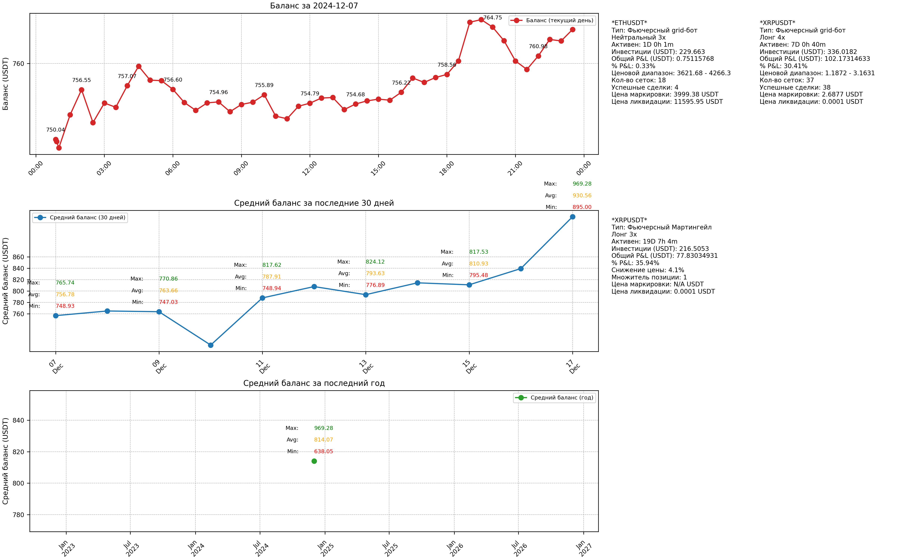
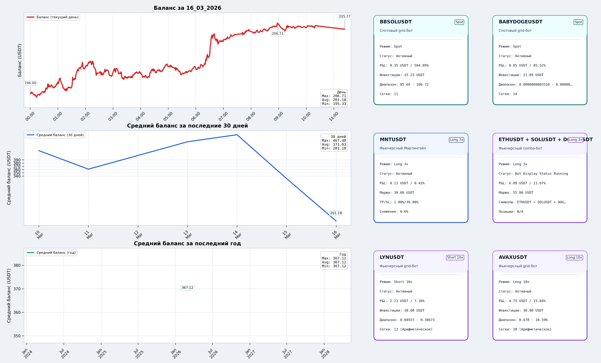
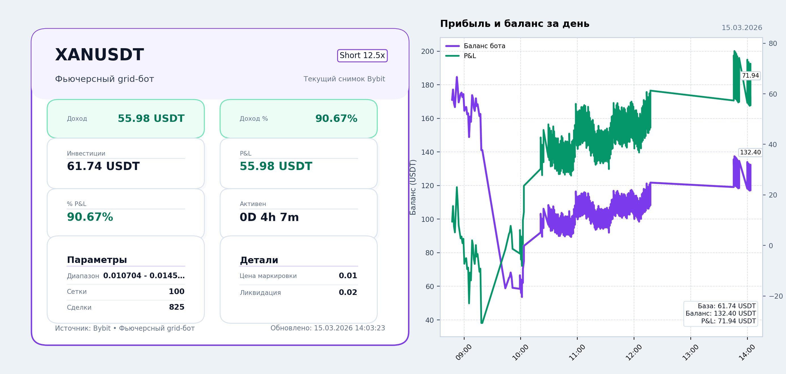
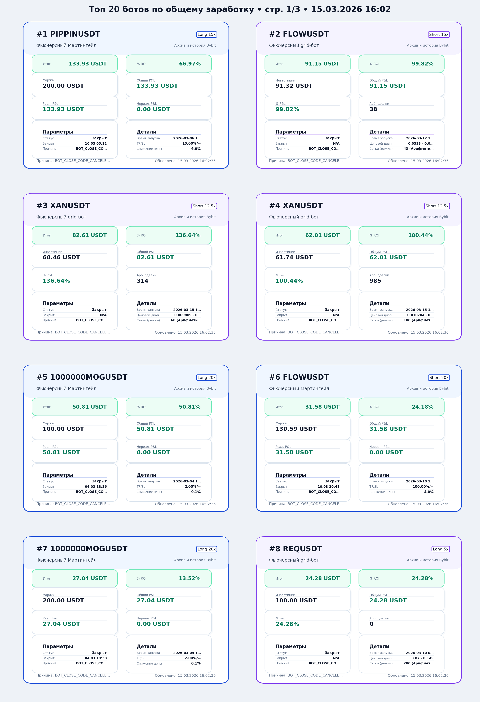

# Bybit Telegram Bot Dashboard

Telegram-бот для мониторинга Bybit-ботов: баланс аккаунта, общий dashboard, карточки ботов, архив удалённых ботов, топы, риск-уведомления, админ-панель и локальный API без перезапуска процесса.

## Что было в старой версии на GitHub

Раньше репозиторий показывал в основном старый Telegram-интерфейс и графики без карточек ботов, без топов и без расширенного управления.

### Старый Telegram-интерфейс и админка

<p align="center">
  
</p>

### Старый dashboard графиков

<p align="center">
  
</p>

## Что стало после обновы

### Новый overview dashboard

<p align="center">
  
</p>

### Индивидуальные карточки ботов

<p align="center">
  
</p>

### Топы ботов с карточками, фильтрами и пагинацией

<p align="center">
  
</p>

## Что добавлено и доработано

### 1. Карточки ботов

Раньше их вообще не было. Теперь бот умеет:

- строить отдельные карточки по каждому активному боту
- показывать `P&L`, `% ROI`, инвестиции, статус, диапазон, сетки, ликвидацию и другие параметры
- рисовать дневной график прибыли и баланса прямо в карточке бота

### 2. Топы

Раньше секции `Топ` не было. Теперь есть:

- топ по заработку
- топ по `P&L`
- топ по `% ROI`
- пагинация, чтобы карточки оставались читаемыми
- карточный формат топов вместо пустых мини-блоков

### 3. Архив и статистика

- удалённые и завершённые боты сохраняются по `bot_id`
- архив больше не чистится после удаления бота
- доступны исторические данные для статистики и будущей аналитики
- подтягиваются боты, которые работали ещё до части новых доработок

### 4. Админ-панель

Старая админка была заметно проще. Сейчас в ней появилось больше управления:

- просмотр текущей конфигурации
- горячее перечитывание конфига без рестарта процесса
- настройки уведомлений
- управление интервалами обновления
- архив / графики / сервисные действия
- подготовка базы и служебных данных прямо из бота

### 5. Риск-уведомления

- уведомления стали информативнее по формату и содержимому
- появились inline-действия: отключить тип сигнала и отложить на 30 минут
- алерты учитывают плечо, просадку, расстояние до ликвидации и повторный вход после свежего убытка

### 6. Local API

Теперь можно без перезапуска `tgbybit.py`:

- читать данные из БД
- смотреть баланс и архив ботов
- запрашивать данные Bybit
- менять настройки бота
- запускать синхронизацию и служебные действия

## Быстрый старт

1. Установите зависимости:

```bash
pip install -r requirements.txt
```

2. Скопируйте `config.example.json` в `config.json`.

3. Заполните:

- `TOKEN`
- `cookies`
- `admins`
- `chat_id`

4. Запустите:

```bash
python tgbybit.py
```

## Local API

По умолчанию API поднимается на `127.0.0.1:8877`.

Основные endpoints:

- `GET /api/health`
- `GET /api/config`
- `GET /api/balance/latest`
- `GET /api/bots/active`
- `GET /api/bots/archive?limit=20`
- `GET /api/bybit/bots?scope=active`
- `POST /api/config`
- `POST /api/db/query`
- `POST /api/actions/sync`


