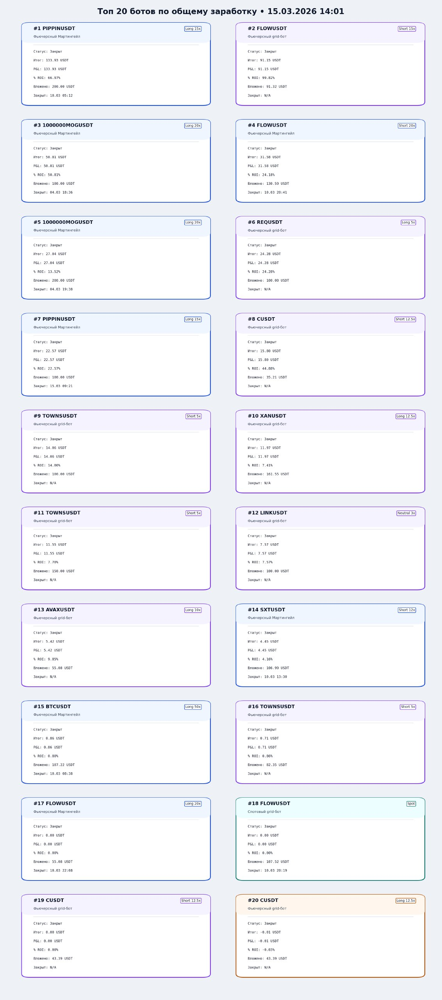

# Bybit Telegram Bot Dashboard

Telegram-бот для мониторинга Bybit-ботов, архива истории, топов, графиков и риск-уведомлений.

## Что умеет

- Собирает баланс аккаунта и breakdown по ботам / funding.
- Хранит архив активных и удалённых ботов по `bot_id`.
- Строит общий график баланса и карточки отдельных ботов.
- Показывает `Топ` по заработку, `P&L` и `% ROI`.
- Отправляет риск-уведомления с inline-действиями.
- Поднимает локальный HTTP API для чтения БД, обновления настроек и синхронизации без рестарта процесса.

## Было / Стало

На GitHub высокие изображения в таблице обычно становятся слишком мелкими, поэтому сравнение вынесено вертикально.

### Было



### Стало


## Основные изменения в обнове

- Топы переведены на карточную логику с richer-данными по боту.
- Добавлены страницы топов и переключение по фильтрам.
- Улучшены risk-уведомления: больше контекста, кнопки отключения типа сигнала и snooze на 30 минут.
- Добавлен локальный API для доступа к БД и горячего обновления настроек.
- История удалённых ботов больше не чистится и используется для статистики.

## Быстрый старт

1. Создайте виртуальное окружение и установите зависимости:

```bash
pip install -r requirements.txt
```

2. Скопируйте `config.example.json` в `config.json`.

3. Заполните:

- `TOKEN`
- `cookies`
- `admins`
- `chat_id`

4. Запустите:

```bash
python tgbybit.py
```

## Local API

По умолчанию API поднимается на `127.0.0.1:8877`.

Примеры:

- `GET /api/health`
- `GET /api/config`
- `GET /api/balance/latest`
- `GET /api/bots/active`
- `GET /api/bots/archive?limit=20`
- `GET /api/bybit/bots?scope=active`
- `POST /api/config`
- `POST /api/db/query`
- `POST /api/actions/sync`

## Безопасность

- Реальный `config.json` не должен попадать в git.
- В репозитории лежит только `config.example.json` без токенов, cookies и chat/admin данных.
